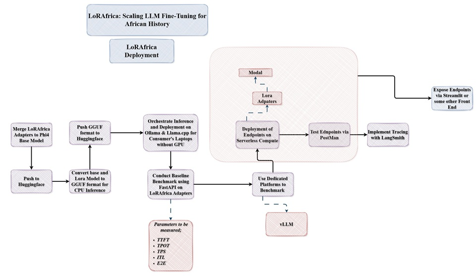

# **LoRAfrica: Modal Serveless Compute with Streamlit**


This project represents the final phase of [LoRAfrica](https://github.com/daniau23/LoRAfrica) deployment, making the system accessible to users on the web through scalable serverless infrastructure using Modal and an interactive frontend built with Streamlit.

## **Aim**
Deploy LoRAfrica via Modal and Streamlit for seamless web-based user interaction.

## **Objectives**
- Benchmark performance using Naive and vLLM approaches while measuring TTFT, ITL, TPOT, E2E, and TPS  
- Deploy LoRAfrica using Modal serverless GPU infrastructure  
- Enable logging and observability with LangSmith, including PII redaction  
- Build and render a Streamlit-based frontend for user interaction  

## **How the Project Goes**
- Navigate to your desktop and create a new folder called `llm_gpu` 
- Install Git and clone the repo using 
```bash
git clone https://github.com/daniau23/LoRAfrica_Serverless_Modal_Compute_Streamlit.git
```
or just download the repo and unzip it
- Download and install &nbsp;[Anaconda](https://www.anaconda.com/products/distribution#Downloads)
    - Once Conda is installed, open your CMD and run the following command `C:/Users/your_system_name/anaconda3/Scripts/activate`
    - Should see something like `'(anaconda3)'C:\Users\your_system_name\Desktop\>` as an output in your CMD
        > NB: Do not close the CMD terminal, would be needed later on 
- On your cmd navigate into the `llm_cpu` folder using `cd llm_gpu`
- Run `conda env create -f environment.yml -p ../llm_gpu/lorafrica_cloud` on your cmd 
- Run `conda env list` on your cmd to list all environments created using Anaconda
- Run `conda activate C:\Users\your_system_name\Desktop\llm_gpu\lorafrica_cloud` on your cmd to activate the environment
    - Should see something like `'(lorafrica_cloud)'C:\Users\your_system_name\Desktop\llm_gpu>` as an output in your CMD
- Run `conda list`  on your cmd to check if all dependencies have been installed

All benchmarks were ran using Runpod so kindly refer to this [video](https://youtu.be/Wofw-l7Cnis?si=_2z2oO0g90P7hO9p) to learn on to create a Pod instance and get started with Runpod

- Once instance is created, clone project into runpod workspace environment using `git clone https://github.com/daniau23/LoRAfrica_Serverless_Modal_Compute_Streamlit.git` and navigate into the benchmarks folder or just drag and drop  files from the benchmarks folder into Runpod. 
    - Once all files in the benchmarks folder are on Runpod
    - Read the ```requirements.txt``` file and follow the instructions after installing the first round of dependencies using ```pip install -r requirements.txt```

## **Benchmarking (Runpod)**
### **Naive Approach**
- To start the server for naive approach run it by using ```python deploy_baseline_runpod.py```. Once the server has started, open another CMD terminal and run the test to ping the server to be sure it is working with ```python test_server_runpod.py```. It should give a json response structure for 1 response as seen in the ```phi4_final_bench_20260327.json``` in the results folder

- All benchmarks tests are ran using the ```inference_baseline_runpod.ipynb``` file
- T kill the server, simply use ```CTRL + C``` in the CMD terminal of where the server was started

### **vLLM Approach**
vLLM is a simpler approach in benchmarking LLM metrics
- Ensure all files from the vllm folder are on Runpod
- start the vllm server using;
    ```bash 
    vllm serve microsoft/Phi-4-mini-instruct \
    --enable-lora \
    --lora-modules african-history=DannyAI/phi4_african_history_lora_ds2_axolotl \
    --max-model-len 512 \
    --gpu-memory-utilization 0.9 \
    ```
    The command can also be found in the ```inference_vllm_runpod.ipynb``` file
- Run Each Benchmark using the codes in the notebook, example code is shown below
```bash
vllm bench serve \
    --model african-history \
    --tokenizer microsoft/Phi-4-mini-instruct \
    --dataset-name custom \
    --dataset-path ./data/history_messages_dataset.jsonl \
    --num-prompts 125 \
    --max-concurrency 4 \
    --metric-percentiles 95,99 \
    --save-result \
    --result-dir ./results_african_history/run_c4
```
Results would be saved in the ```results_african_history``` folder

To kill the vLLM server run ```stop_vllm_server()``` function in the notebok

Congrats! You have Benchmarked the LLM with Naive and vLLM Approaches.  Now the Deployment Phase!!!!!!!!

## **Deployment**
### **Modal Deployment: Severless Compute**
- Ensure your enviroment is configured via ```.yaml``` file
- navigate to the deployment folder
- The ```server.py``` is your file for server side deployment; your backend logic. The ```client.py``` is your frontend logic for testing and interactions
- Create your [Modal account](https://modal.com/signup)
- To delpoy your Modal app use ```modal setup``` to authenticate yourself into Modal. Once Authenticated, run ```modal deploy server.py``` and your compute instance is created!

*NB:* Add same ```.env``` variables (LangSmith, HuggingFace) as Modal secrets to enable logging and avoid runtime errors..

### **Streamlit Rendering**
- The Streamlit folder has your client file; ```streamlit_app.py``` (frontend) for rendering user interface and usage. Simply run it using ```streamlit run streamlit_client.py``` in the CMD.

That's it!! You have your working project all set and ready to GO! 🚀

Check out the CPU version of this [project using Ollama and Llama.cpp](https://github.com/daniau23/LoRAfrica_CPU)

**NB:** Kindly check tests in `modal/streamlit/tests`

## **Issues Faced**
- Setting up LiteLLM as a proxy to monitor billing and token usage which would allow alerting messages on SLACK
- Trying to rent the needed GPU on Runpod to condut experimentation of naive and vLLM approaches
- Pattern recognition to redact PII's in LangSmith

## **Conclusion**
LoRAfrica demonstrates an end-to-end pipeline for deploying a domain-specific Large Language Model in LLMOps, from fine-tuning and benchmarking to scalable production deployment. By combining LoRA fine-tuning with efficient inference strategies (naive and vLLM), the project evaluates key performance metrics such as TTFT, ITL, TPOT, E2E, and TPS to optimise real-world performance.

The system leverages Modal for serverless GPU-based deployment, enabling automatic scaling and simplified infrastructure management, while Streamlit provides an accessible web interface for user interaction. Additional integrations such as LangSmith ensure observability, logging, and PII redaction for safer and more reliable usage.

Overall, the project highlights how modern tools can be orchestrated to deliver a scalable, efficient, and production-ready AI application tailored to African history knowledge.

## **Key Contributions**
- Built a domain-specific LLM using LoRA fine-tuning for African history
- Benchmarked inference performance using both naive and vLLM approaches
- Measured and analysed key latency and throughput metrics (TTFT, ITL, TPOT, E2E, TPS)
- Deployed the model using serverless GPU infrastructure via Modal
- Developed an interactive frontend using Streamlit for real-time user interaction
- Integrated LangSmith for monitoring, logging, and PII redaction

Article Links
- [ReadyTensor](https://app.readytensor.ai/publications/lorafrica-modal-serverless-compute-deployment-with-streamlit-uSaVNazSK0yQ)
- [Streamlit App](https://lorafrica.streamlit.app/)